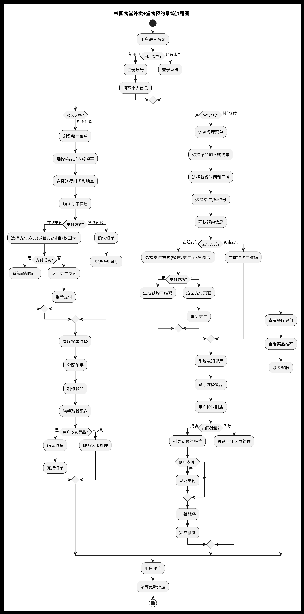

# 校园食堂外卖+堂食预约系统

## 1. 需求分析

### 用户需求
- 用户注册和登录功能
- 在线点餐和外卖订购
- 堂食预约和座位选择
- 支付功能（微信/支付宝/校园卡）
- 订单跟踪和状态查询
- 用户评价和反馈系统

### 系统功能
- 用户管理系统
- 菜品管理系统
- 订单管理系统
- 座位预约管理
- 支付系统集成
- 配送管理系统
- 评价管理系统

### 技术需求
- 响应式网页设计
- 实时订单更新
- 安全的支付系统
- 高并发处理能力
- 数据备份和恢复机制

## 2. 系统描述

### 用户端功能
1. **注册和登录**
   - 新用户注册
   - 用户登录
   - 个人信息管理

2. **点餐系统**
   - 浏览菜品
   - 购物车管理
   - 选择配送时间
   - 在线支付

3. **堂食预约**
   - 查看座位状态
   - 预约座位
   - 选择就餐时间
   - 在线支付

4. **订单管理**
   - 查看订单历史
   - 订单状态跟踪
   - 取消订单
   - 评价订单

### 管理端功能
1. **菜品管理**
   - 添加/修改菜品
   - 设置价格
   - 管理库存
   - 上下架管理

2. **订单管理**
   - 接收订单
   - 处理订单
   - 配送管理
   - 订单统计

3. **座位管理**
   - 座位状态管理
   - 预约管理
   - 就餐时间管理

4. **系统管理**
   - 用户管理
   - 权限管理
   - 数据统计
   - 系统设置

## 3. 如何运行应用

### 环境要求
- Node.js 16.x 或更高版本
- MySQL 8.0 或更高版本
- Redis（用于缓存）

### 安装步骤
1. 克隆项目
```bash
git clone [项目地址]
cd campus-canteen-system
```

2. 安装依赖
```bash
npm install
```

3. 配置环境变量
```bash
cp .env.example .env
# 编辑 .env 文件，填写数据库等配置信息
```

4. 初始化数据库
```bash
npm run db:migrate
npm run db:seed
```

5. 启动应用
```bash
npm run dev  # 开发环境
npm run build  # 构建生产环境
npm run start  # 运行生产环境
```

### 访问应用
- 开发环境：http://localhost:3000
- 默认管理员账号：admin
- 默认管理员密码：admin123

## 4. 系统流程图

### 需求分析图


### 系统流程图
 